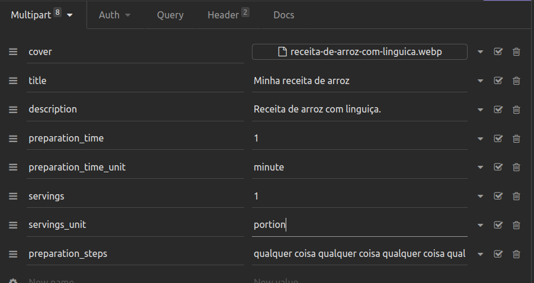

<h1 align="center">Django Recipes</h1>
<p align="center">Neste projeto, foi desenvolvida uma aplicação full stack de um site de receitas utilizando Django Web Framework
  e Django Rest Framework possibilitando fazer um CRUD de receitas com um controle por parte dos administradores.</p>

---

<br>

<h2 align="center">📃 Sobre o Projeto</h2>

<p align="center">Foi desenvolvida uma aplicação em Python Django que permite fazer um CRUD para um banco de dados. Esse CRUD possibilita
  tanto a criação quanto o login de usuários, assim como criação edição e deleção de receitas, tudo isso atravez de forms.
  Também foi disponibilizado uma API construida em Rest Framework, que possibilita também um CRUD na aplicação atravez de métodos HTTP, 
  possibilitando também a adição e login de usuários, tendo sua validação através de Jwt validators, possibilitando também a criação edição
  e deleção de receitas.
  Foram feitos testes unitários funcionais e ponta a ponta cobrindo 90% da aplicação, foi utilizado: pytest, django testing e selenium.
</p>

<br>

---

### 🛠 Tecnologias e Bibliotecas utilizadas no desenvolvimento do projeto

- **[Python](https://docs.python.org/3/)**
- **[Django](https://docs.djangoproject.com/pt-br/4.2/)**
- **[Rest Framework](https://www.django-rest-framework.org/)**
- **[Simple Jwt](https://django-rest-framework-simplejwt.readthedocs.io/en/latest/getting_started.html)**
- **[Pytest](https://pytest.org/en/7.4.x/index.html)**
- **[Django testing](https://docs.djangoproject.com/en/4.2/topics/testing/)**
- **[Selenium](https://www.selenium.dev/documentation/)**
- **[Django debug toolbar](https://django-debug-toolbar.readthedocs.io/en/latest/)**
- **[Pillow](https://pillow.readthedocs.io/en/stable/)**
- **[CORS](https://developer.mozilla.org/en-US/docs/Web/HTTP/CORS)**

---

### 🚀 Como executar o projeto

_Clone o repositorio_

```jsx
  git clone git@github.com:TonyyCruz/django-recipes.git && cd django-recipes
```

---

- Renomeie e configurar o arquivo .env.example (deve ser criado um arquivo `.env` com o conteudo do `.env.example` configurado)

---

<details>
  <summary><strong>:computer: Rodando Localmente</strong></summary><br />

 _Crie o ambiente virtual_

 ```jsx
  python3 -m venv .venv
 ```

_Ative o ambiente virtual_

 ```jsx
  source .venv/bin/activate
 ```
 
 _Instale as dependências com o comando_
 
 ```jsx
  python -m pip install -r dev-requirements.txt
 ```

_Rode o servidor_
 
 ```jsx
  python manage.py runserver
 ```

_Rodar os testes_
 
 ```jsx
  python -m pytest
 ```
  
 ⚠️ Atenção: Não esqueça de que você deve estar com o ambiente virtual ativo.
</details>

---

<details>
  <summary><strong>:whale: Rodando no Docker</strong></summary><br />
 
 
_Rode na raiz do projeto o comando_

```jsx
  docker-compose up -d
```

- Esse serviço irá inicializar um container chamado `recipes` e adicionará uma imagem docker chamada django-recipes_web.
- A partir daqui você pode rodar o container via CLI ou abri-lo no VS Code.

_Via CLI use o comando_

```jsx
docker exec -it recipes bash
```
- Ele te dará acesso ao terminal interativo do container recipes criado pelo compose, que está rodando em segundo plano.

_Rodar os testes_
 
 ```jsx
  python -m pytest
 ```

Ps: Os testes em selenium só estão funcionando rodando localmente.

## Este container estara espelhando os arquivos da sua máquina.

</details>
<br>

---

<h2 align="center">Rotas utilizáveis na API</h2>

- É recomendado utilizar algum cliente HTTP, como [Postman](https://www.postman.com/) ou o [Insomnia](https://insomnia.rest/download).

<details>
  <summary><strong>Ver rotas</strong></summary><br />

  <details>
    <summary>POST</summary>
  
  - POST `http://localhost:8000/authors/api/v2/` para cadastrar novo usuario. Utilize um body nesse formato:
    
    ```jsx
      {
      	"first_name": "SeuNome",
      	"last_name": "SeuSobrenome",
      	"username": "SeuUsername",
      	"password": "SeuPassword1.",
      	"email": "algo2@email.com"
      }
    ```

  ---
    
  - POST `http://localhost:8000/recipes/api/token/` para fazer login e receber um token. Utilize um body nesse formato:
    
    ```jsx
      {
      	"username": "SeuUsername",
      	"password": "SeuPassword1.",
      }
    ```
      
  ---

- POST `http://localhost:8000/recipes/api/token/refresh/` para atualizar o token. Utilize um body nesse formato:
  
  ```jsx
    {
	    "refresh": "<O "refresh" token que foi recebido ao fazer login>"
    }
  ```
    
---

- POST `http://localhost:8000/recipes/api/token/verify/` para validar o token. Utilize um body nesse formato:
  
  ```jsx
    {
	    "token": "<O "access" token que foi recebido ao fazer login>"
    }
  ```
    
---
  
- POST `http://localhost:8000/recipes/api/v2/` para criar uma nova receita. Utilize um body nesse formato:
  <br>
  Para essa ação, o usuário deve enviar o "access" token no Header da requisição.
  `Authorization`  `Bearer <access token>`

  ```jsx
    {
    	"title": "Minha receita",
    	"description": "Uma receita deliciosa",
    	"preparation_time":10,
    	"preparation_time_unit": "minute",
    	"servings": 10,
    	"servings_unit": "portion",
    	"preparation_steps": "Descrição dos passos necessários para a criação bem sucedida da receita."
    }
  ```
    ps: Para enviar a imagem, os mesmos dados devem ser enviados por multipart form com a inclusão do campo "cover".
  	<details>
  		
	</details>

  </details>

  ---

  <details>
    <summary>GET</summary>

  - GET `http://localhost:8000/authors/api/v2/<id>` exibe os dados do próprioe só o mesmo pode acessar.
	  <br>
	  Para essa ação, o usuário deve enviar o "access" token no Header da requisição.
	  `Authorization`  `Bearer <access token>`
	
	---
	
  - GET `http://localhost:8000/authors/api/v2/me` exibe os dados do usuário autenticado.
    <br>
    Para essa ação, o usuário deve enviar o "access" token no Header da requisição.
  `Authorization`  `Bearer <access token>`
	
  ---
	  
  - GET `http://localhost:8000/authors/api/v2/` exibe todas as receitas publicadas.
	  
  ---
  
  - GET `http://localhost:8000/authors/api/v2/<id>` uma receita publicada de acordo com o id.
	  
  ---
	  
  - GET `http://localhost:8000/authors/api/v2/?category_id=<id>` busca receitas publicada de acordo com a categoria.
	
  ---
	  
  - GET `http://localhost:8000/authors/api/v2/?q=<search>` busca receitas de acordo com a palavra passada "<search>".
	
</details>

---

<details>
<summary>PATCH</summary>

Para todos os métodos PATCH, o usuário devera enviar o "access" token no Header da requisição.
    `Authorization`  `Bearer <access token>`
	
- PATCH `http://localhost:8000/authors/api/v2/<id>/` para atualizar dados do usuário. Utilize um body nesse formato:
   
```jsx
  {
    "last_name": "Cruz"
  }
```
	
---
	
- PATCH `http://localhost:8000/recipes/api/v2/<id>/` para atualizar a receita. Utilize um body nesse formato:
	
```jsx
    {
      "title": "Novo titulo",
      "description": "Nova descrição",
    }
```

</details>

---

<details>
<summary>DELETE</summary>

Para todos os métodos DELETE, o usuário devera enviar o "access" token no Header da requisição.<br>
`Authorization`  `Bearer <access token>`
  
- DELETE `http://localhost:8000/authors/api/v2/<id>` deleta o usuário.
  
---
  
- DELETE `http://localhost:8000/recipes/api/v2/<id>` deleta a receita se a mesma pertencer ao usuário.

 </details>

---

<details>
<summary>HELP</summary>

Ao passar a `Authorization` é obrigatório o uso da palavra `Bearer` antes do token:


</details>

</details>

---

<h2 align="center">Funcionamento</h2>
<br>

- A aplicação roda na url `http://localhost:8000/`
- Para facilitar a sua experiência, tem um super usuário cadstrado `Username: admin` `password: admin`.
- A área de administração do site fica em `http://localhost:8000/admin`.
- Qualquer usuário cadastrado pode criar receitas, mas apenas administradores podem publicá-las.
- Foram adicionadas algumas receitas fictícias para a visualização.
